# CS 294 at UC Berkeley: Deep Reinforcement Learning

This repo includes my solutions to the assigments of the UC Berkeley Deep Reinforcement Learning course offered in Fall 2018, taught by Sergey Levine. 

Course URL: http://rail.eecs.berkeley.edu/deeprlcourse/ 

Course GitHub: https://github.com/berkeleydeeprlcourse/homework

I would like to thank the instructor and the TAs for making this wonderful course.

## Code structure
- `./hw1/`: contains code for the implementation of **imitation learning**, including direct **behavior cloning** and the **DAgger** algorithm. See my report for this homework [here](./hw1/README.md). 
- `./hw2/`: contains code for the implementation of **policy gradient** and its variants, including **variance reduction methods**. See my report for this homework [here](./hw2/README.md). Below you can see some cool videos showing the comparison between the learning agent before and after training using the policy gradient.

|  |Before training  |	After training 	
|--|--|--|	
| CartPole | 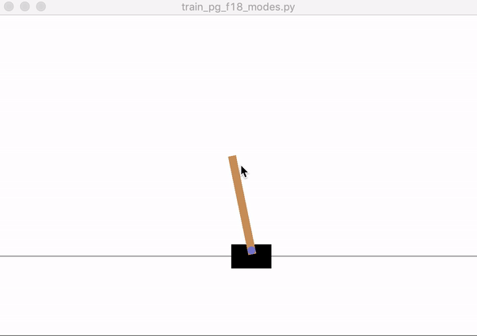 | 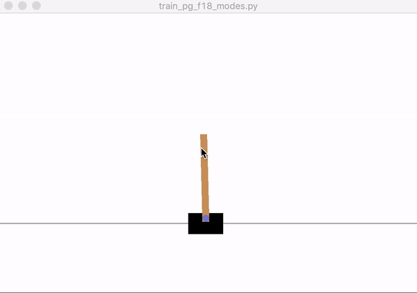 |
| LunarLander | 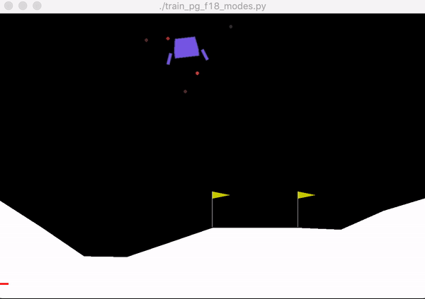 | 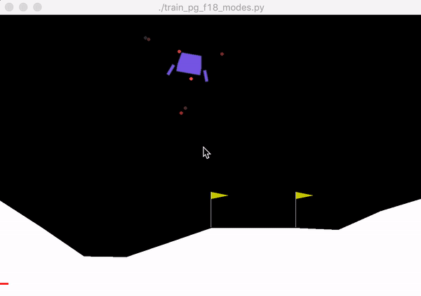 |
| InvertedPendulum | 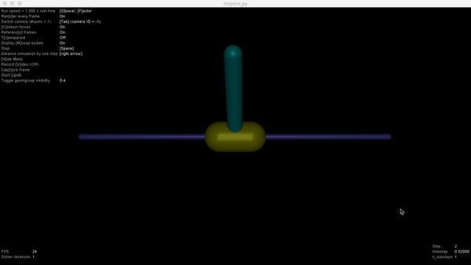 | 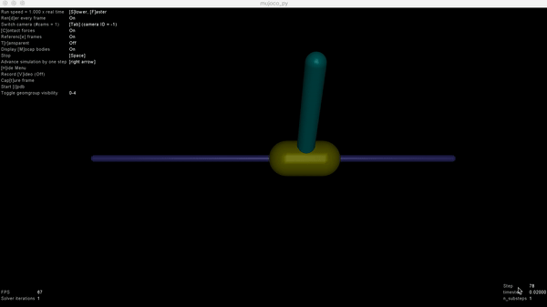 |
| HalfCheetah | 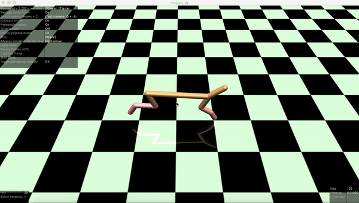 | 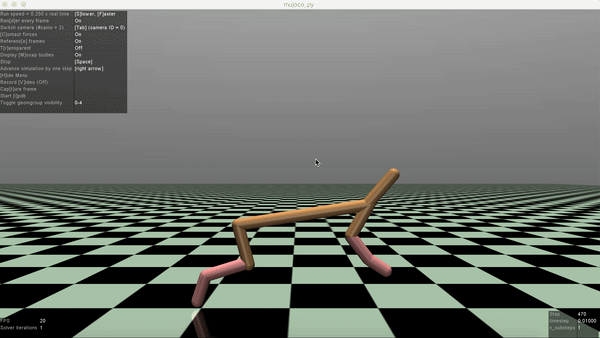 |

- `./hw3/`: contains code for the implementation of **Deep Q-Learning** and **Actor-Critic**. See my report for this homework [here](./hw3/README.md). Below you can see some cool videos showing the comparison between the learning agent before and after training using Deep Q-Learning.

|  |Before training  |	After training 	
|--|--|--|	
| LunarLander | 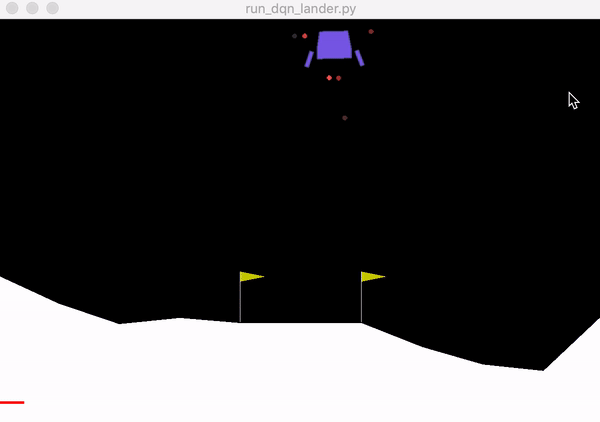 | 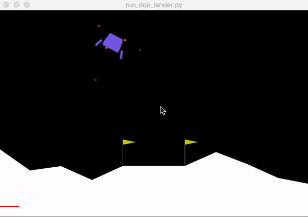 |

`Pong Atari (green pedal is controlled by our learning agent) `

| After 0 timesteps | 	After 500K timesteps | After 1M timesteps | After 1.5M timesteps | After 2M timesteps
|--|--|--|--|--|
| 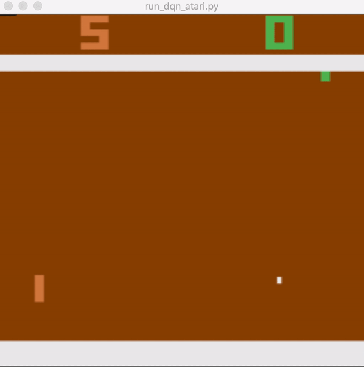 |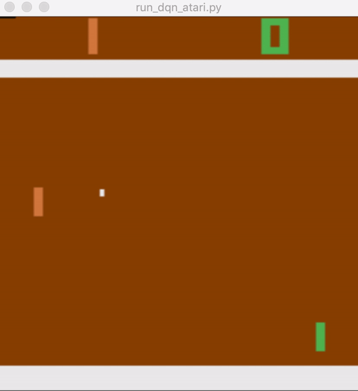 |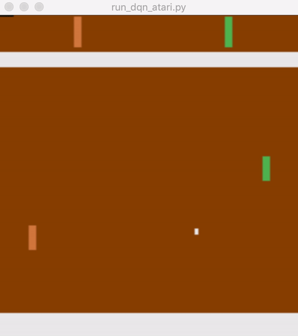 |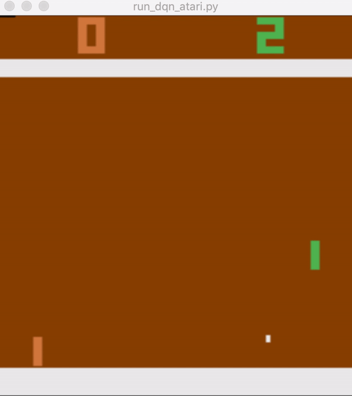 |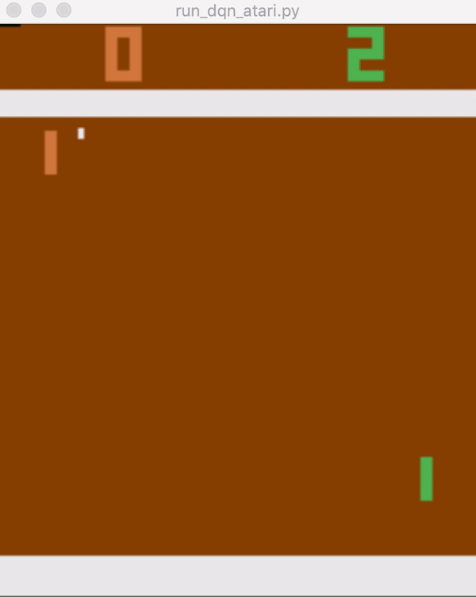|

- `./hw4/`: contains code for the implementation of an algorithm for the **model-based reinforcement learning (MBRL)**. See my report for this homework [here](./hw3/README.md). 