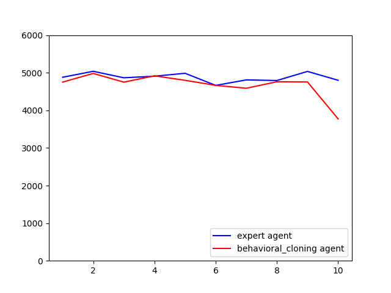
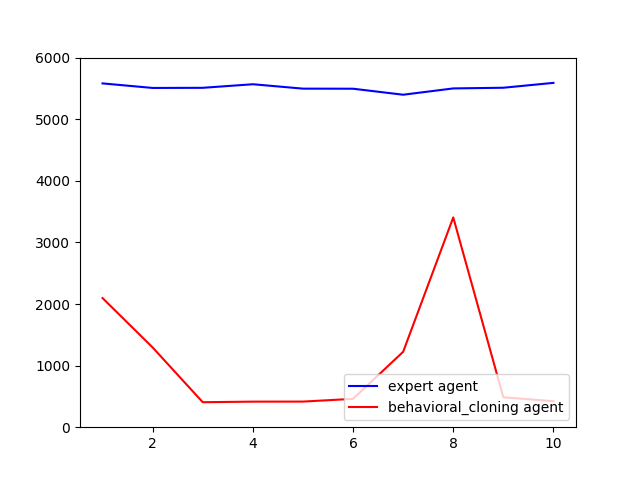
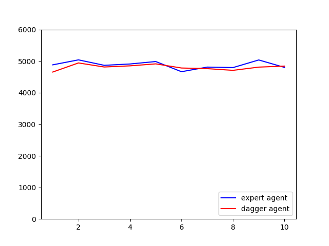
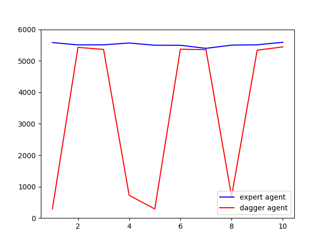
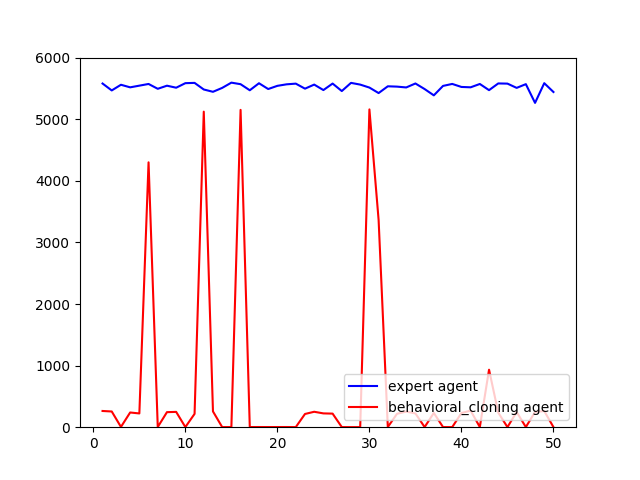
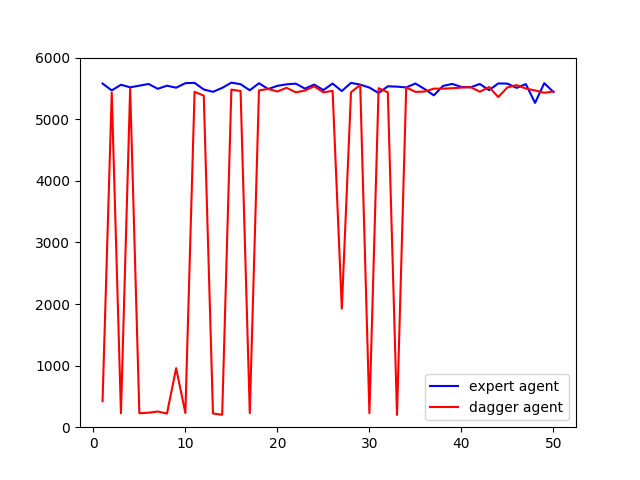

# Homework 1

The goal of this assignment was to experiment with **imitation learning**, including direct **behavior cloning**
and the **DAgger** algorithm.

## Answers

### Section 2. Behavioral Cloning:
1. *Run behavioral cloning (BC) and report results on two tasks { one task where a behavioral cloning agent achieves comparable performance to the expert, and one task where it does not. When providing results, report the mean and standard deviation of the return over multiple rollouts in a table, and state which task was used.*
	
	Task: `Ant`

	|  | mean  |	standard deviation |
	|--|--|--|	
	| expert agent  |     4878.46            | 112.68
	|  behavioral cloning agent |       4674.42          | 318.47

	Task: `Walker2d`
	
	|  | mean  |	standard deviation 
	|--|--|--|	
	| expert agent  |       5515.39           | 52.61
	|  behavioral agent |       1062.403            |   949.42 
	
	
	
	As we can see for the `Ant` environment, behavioral cloning agent achieves comparable performance to the expert. However, for the `Walker2d` environment, the performance of behavioral cloning is remarkably worse than the performance of the expert agent. One interesting point for the performance of behavioral cloning in the `Walker2d` environment is that the standard deviation of rewards obtained by this agent is   949.42  which exactly shows the limitation of the behavioral cloning: if the observations of the environment are not in the training dataset, the performance is remarkably bad while for the observations of the environment which are available in the training dataset, the performance is relatively better. 
	
	Task: `Ant`

	Task: `Walker2d`
	

### Section 2. Behavioral Cloning:
1. *Run DAgger and report results on one task in which DAgger can learn a better policy than behavioral cloning. Report your results in the form of a learning curve, plotting the number of DAgger iterations vs. the policy's mean return, with error bars to show the standard deviation.*
	
	Task: `Ant`

	|  | mean  |	standard deviation |
	|--|--|--|	
	| expert agent  |     4878.46            | 112.68
	|  behavioral cloning agent |        4806.99          | 82.81

	Task: `Walker2d`
	
	|  | mean  |	standard deviation 
	|--|--|--|	
	| expert agent  |       5515.39           | 52.61
	|  behavioral agent |       3428.693            |   2397.68 
	
	
	
	As we can see for the `Ant` environment, DAgger agent achieves comparable performance to the expert agent. For the `Walker2d` environment, while behavioral cloning couldn't achieve the performance of the expert agent, we can see the performance of the DAgger agent is remarkably better than the behavioral cloning and it acheives the performance of the expert agent in some rollouts.
	
	Task: `Ant`

	Task: `Walker2d`
	

	
	
If we increase the number of rollouts, as we can see from the figures below, the performance of the DAgger agent is getting closer and closer to the expert agent.

Task: `Walker2d`

	

### Todos

 - Write what I learnt about setting this homework (takeaway)
 - Implement the Bonus part!
 - Write code structure
 - ...