# Homework 2

The goal of this assignment was to experiment with **policy gradient** and its variants, including variance reduction methods. In this assignment, the policy gradient was used for both continuous environments (`InvertedPendulum`, `LunarLander`, `HalfCheetah`) as well as discrete environments (`CartPole`). Furthermore, variance reduction tricks, including implementing reward-to-go and neural network baselines, are explored.

## Videos
Below you can see some cool videos showing the comparison between the learning agent before and after training using the policy gradient.

|  |Before training  |	After training 	
|--|--|--|	
| CartPole | 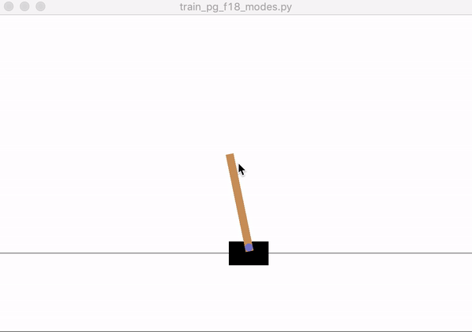 | 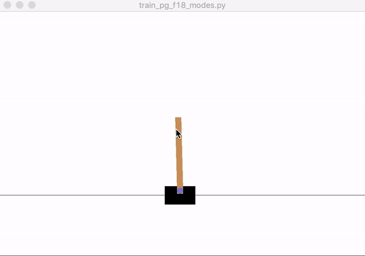 |
| LunarLander | 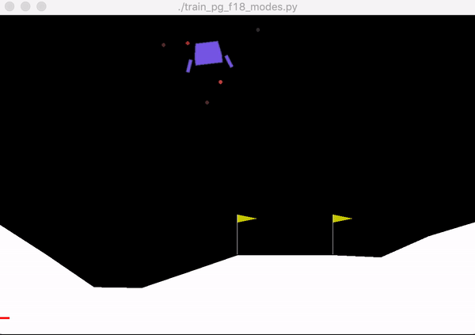 | 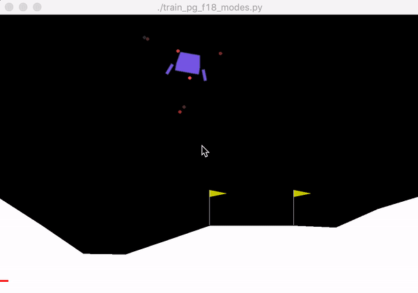 |
| InvertedPendulum | 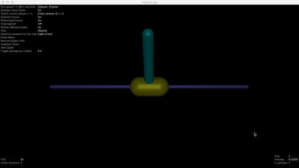 | 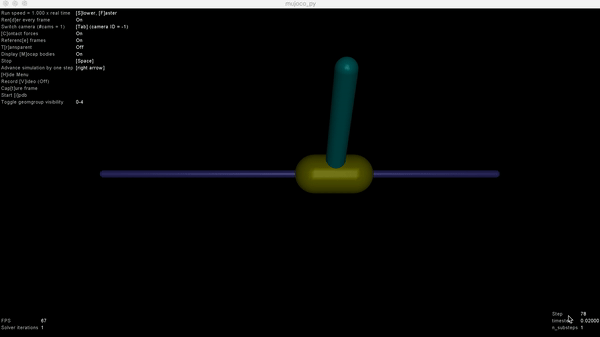 |
| HalfCheetah | 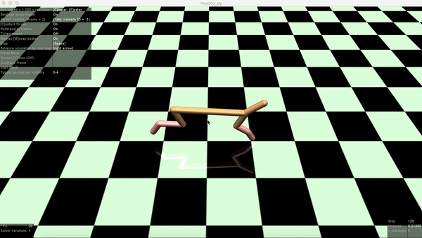 | 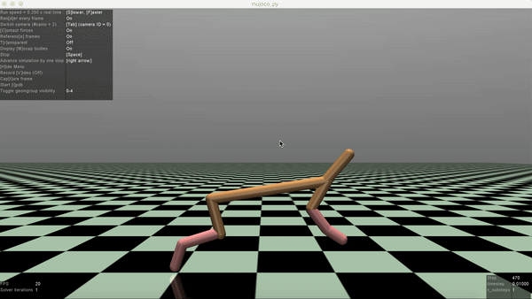 |


## Answers

### Problem 4. CartPole:
1. *Compare the learning curves (average return at each iteration) with small batches (batch size of 1000) under three different settings: vanilla policy gradient (sb_no_rtg_dna), policy gradient with reward to go (sb_rtg_dna), policy gradient with reward to go and advantage normalization (sb_rtg_na).*

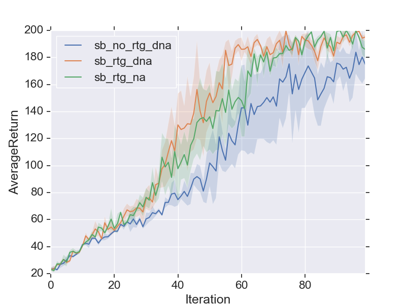

2. *Compare the learning curves (average return at each iteration) with large batches (batch size of 5000) under three different settings: vanilla policy gradient (sb_no_rtg_dna), policy gradient with reward to go (sb_rtg_dna), policy gradient with reward to go and advantage normalization (sb_rtg_na).*

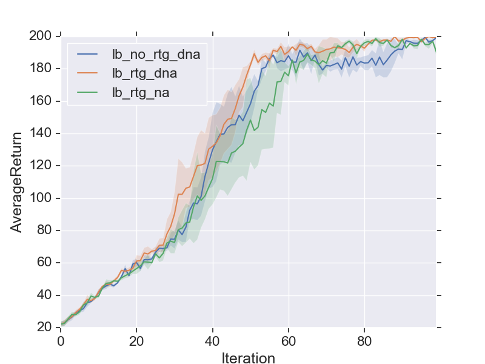

3. *Answer the following questions briefly:*

- *Which gradient estimator has better performance without advantage-centering| the trajectory-centric one, or the one using reward-to-go?*

	As we can see from the above figures, the one using reward-to-go has better performance.

- *Did advantage centering help?*

	As we can see from the above figures, it didn't improve the performance.
- *Did the batch size make an impact?*

	To better see the impact of batch size, I have compared the performance for different batch sizes in the following figure. As we can see from the figure, larger batch sizes stabilize the training process and result in smoother curves.

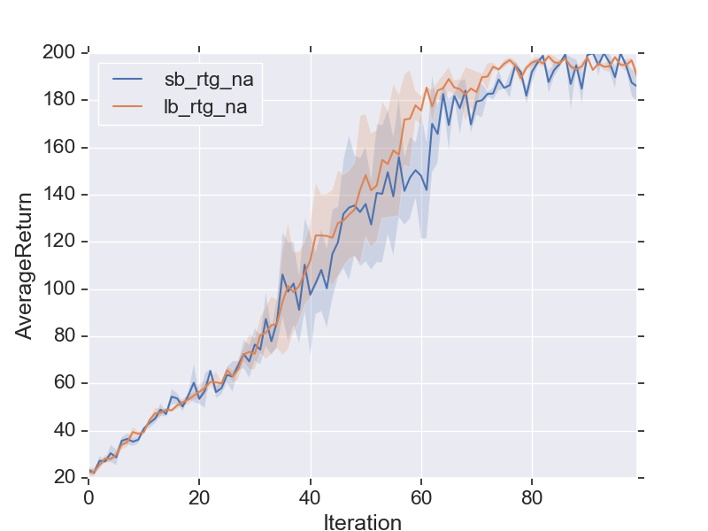


4. *Provide the exact command line configurations you used to run your experiments.* 

```Bash
   python train_pg.py CartPole-v0 -n 100 -b 1000 -e 5 -dna --exp_name sb_no_rtg_dna
   python train_pg.py CartPole-v0 -n 100 -b 1000 -e 5 -rtg -dna --exp_name sb_rtg_dna
   python train_pg.py CartPole-v0 -n 100 -b 1000 -e 5 -rtg --exp_name sb_rtg_na
   python train_pg.py CartPole-v0 -n 100 -b 5000 -e 5 -dna --exp_name lb_no_rtg_dna
   python train_pg.py CartPole-v0 -n 100 -b 5000 -e 5 -rtg -dna --exp_name lb_rtg_dna
   python train_pg.py CartPole-v0 -n 100 -b 5000 -e 5 -rtg --exp_name lb_rtg_na 

```


### Problem 5. InvertedPendulum:

1. *Given the best batch size and best learning rate you found, provide a learning curve where the policy gets to optimum (maximum score of 1000) in less than 100 iterations.*

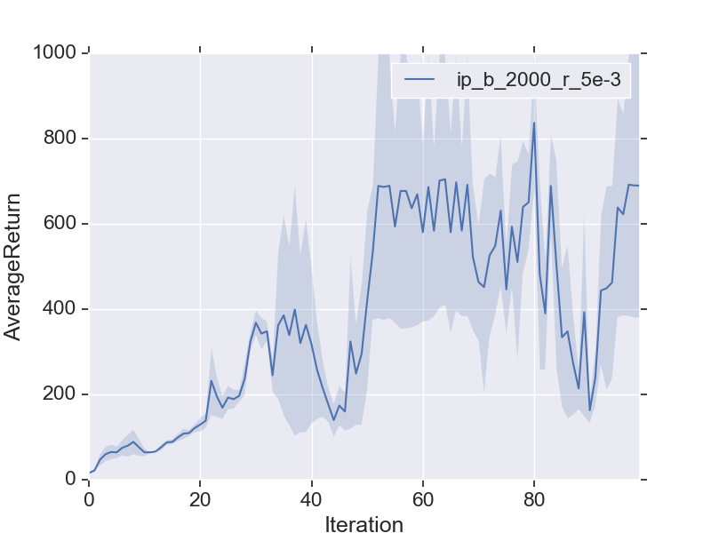

2. *Provide the exact command line configurations you used to run your experiments.* 

```Bash
   python train_pg_f18.py InvertedPendulum-v2 -ep 1000 --discount 0.9 -n 100 -e 3 -l 2 -s 64 -b 2000 -lr 5e-3 -rtg --exp_name hc_b_2000_r_5e-3

```

### Problem 7: LunarLander:

1. *Plot a learning curve for the below command. You should expect to achieve an average return of around 180.*

```Bash
   python train_pg_f18.py LunarLanderContinuous-v2 -ep 1000 --discount 0.99 -n 100 -e 3 -l 2 -s 64 -b 40000 -lr 0.005 -rtg --nn_baseline --exp_name ll_b40000_r0.005

```

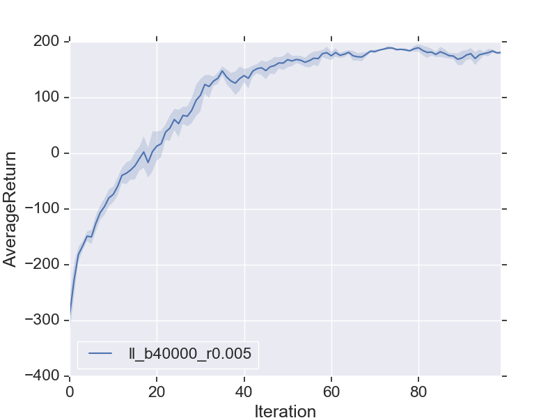

### Problem 8: HalfCheetah:

1. *Search over batch sizes of [10000, 30000, 50000] and learning rates of [0.005, 0.01, 0.02] to replace `<b>` and `<r>` in the command below and show how the batch size and learning rate affect the performance.*

```Bash
   python train_pg_f18.py HalfCheetah-v2 -ep 150 --discount 0.9 -n 100 -e 3 -l 2 -s 32 -b <b> -lr <r> -rtg --nn_baseline --exp_name hc_b<b>_r<r>

```
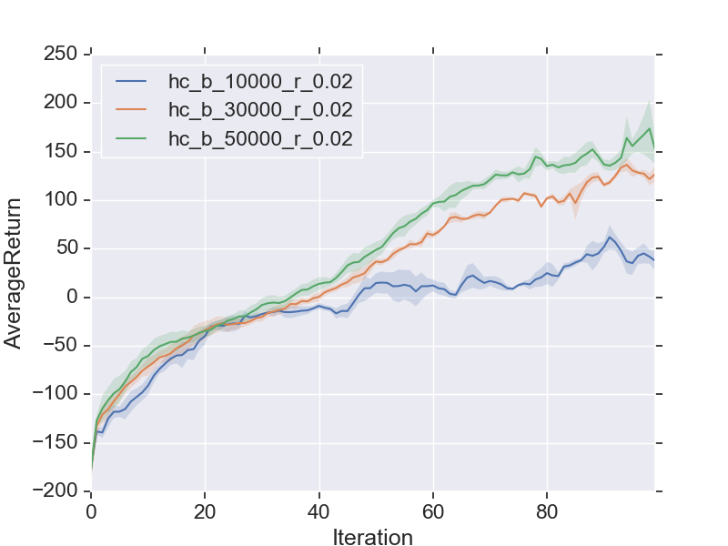

As we can see from the above figures, for the learning rate of 0.02 (the same behavior was observed for the learning rates of 0.005 and 0.01), **as the batch size increases, the training speeds up and the AverageReturn increases**.


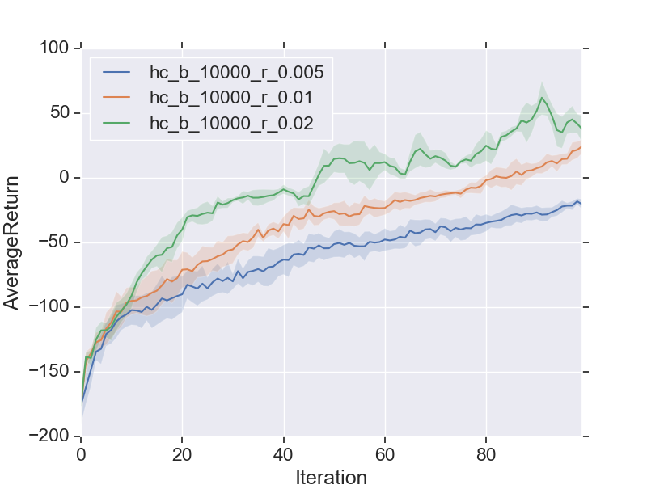
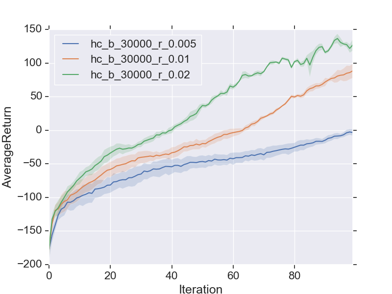
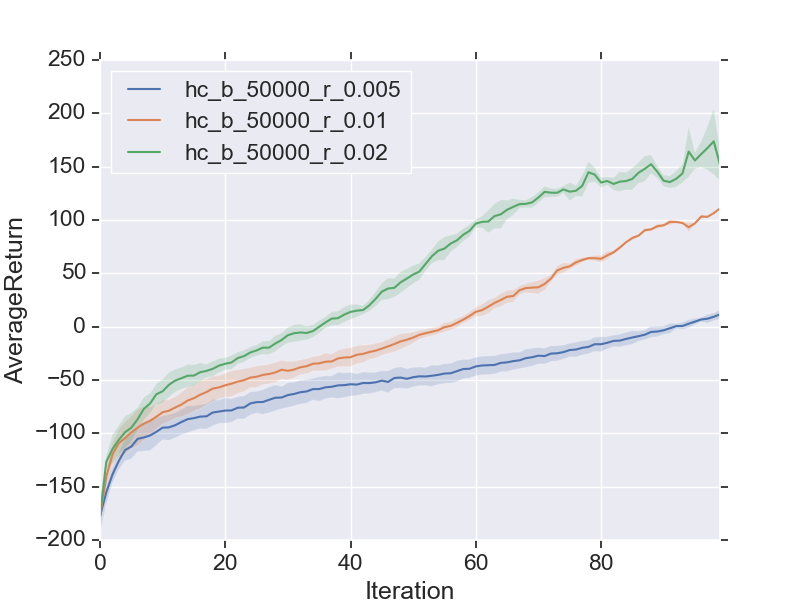

As we can see from the above three figures, for all batch sizes of  [10000, 30000, 50000], as the learning rate increases, the training speeds up and the AverageReturn increases. But is that really the case?! The larger the learning rate, the better and faster the training?! Figures below show the effect of learning rates of [0.0025, 0.005, 0.01, 0.02, 0.04] on the performance.

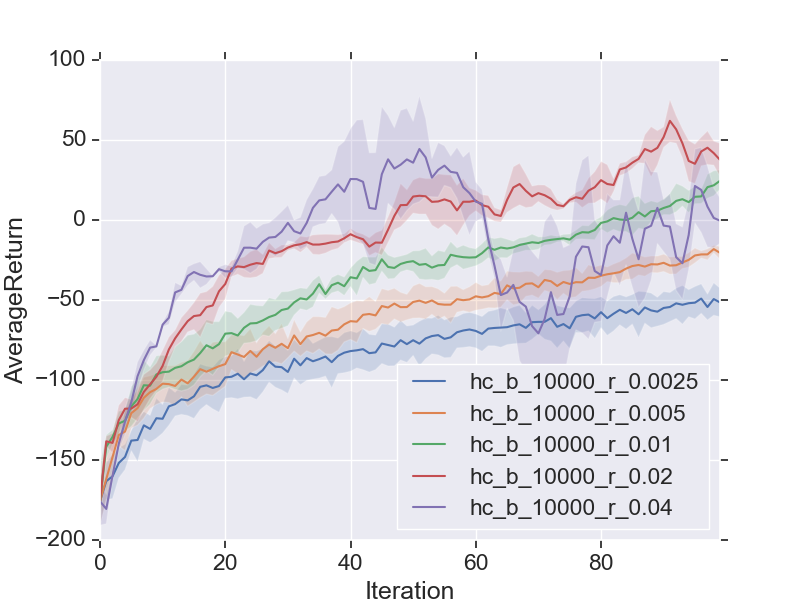
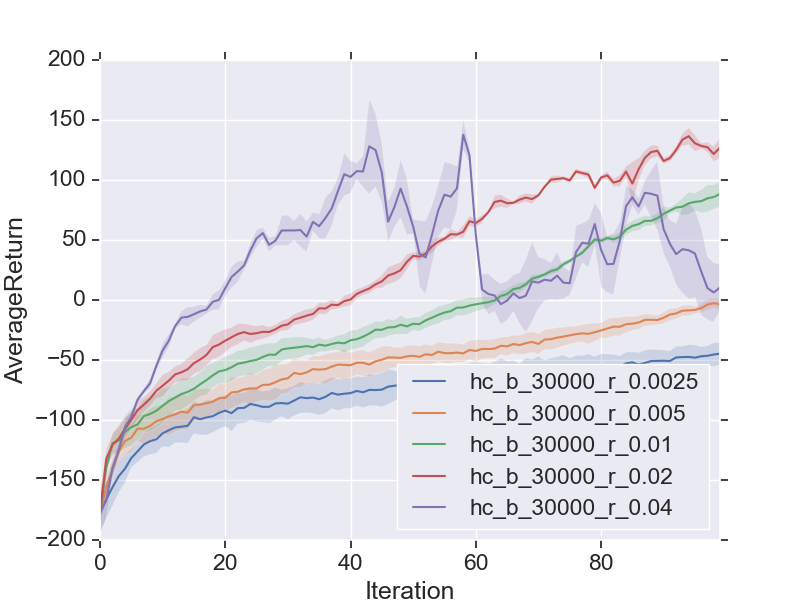
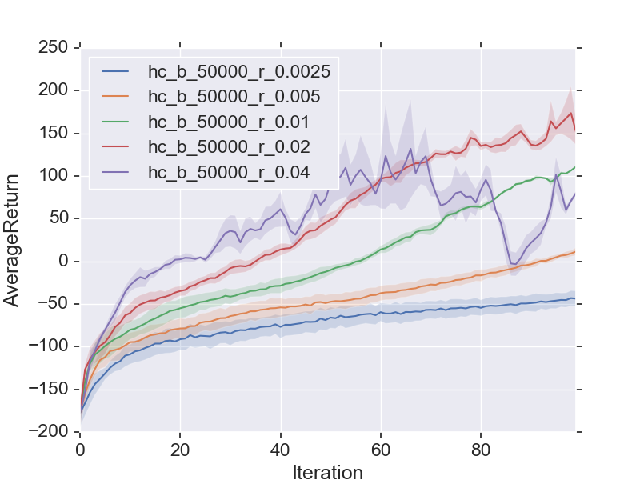

As we can see from the above three figures, **while increasing the learning rate from 0.0025 to 0.02 speeds up the training and increases the AverageReturn, increasing it further to 0.04 deteriorates the performance. Therefore, we should be catious in setting the learning rate**.

2. *Once you've found suitable values of `b` and `r` among those choices (let's call them `b*` and `r*`), use `b*` and `r*` and run the following commands (remember to replace the terms in the angle brackets):*

```Bash
	python train_pg_f18.py HalfCheetah-v2 -ep 150 --discount 0.95 -n 100 -e 3 -l 2 -s 32 -b <b*> -lr <r*> --exp_name hc_b<b*>_r<r*>
	python train_pg_f18.py HalfCheetah-v2 -ep 150 --discount 0.95 -n 100 -e 3 -l 2 -s 32 -b <b*> -lr <r*> -rtg --exp_name hc_b<b*>_r<r*>
	python train_pg_f18.py HalfCheetah-v2 -ep 150 --discount 0.95 -n 100 -e 3 -l 2 -s 32 -b <b*> -lr <r*> --nn_baseline --exp_name hc_b<b*>_r<r*>
	python train_pg_f18.py HalfCheetah-v2 -ep 150 --discount 0.95 -n 100 -e 3 -l 2 -s 32 -b <b*> -lr <r*> -rtg --nn_baseline --exp_name hc_b<b*>_r<r*>

```
I used the learning rate (`r*`) of 0.02 and batch size (`b*`) of 50000.

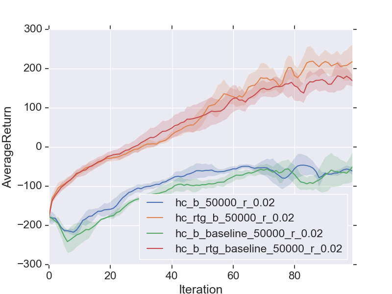

As we can see from the above figure, reward to go (`rtg`) makes the training faster. However, implementing a value function as a
state-dependent neural network baseline (`baseline`) does not seem to have an effect on the training performance.


### Todos

 - Write what I learnt about setting the hyper-parameters for policy gradients (takeaway)
 - Implement one of Bonus part!
 - Write code structure
 - ...