# Homework 3

The goal of this assignment was to experiment with **Deep Q-Learning** and **Actor-Critic**. This assignment has two parts: In part 1, we implement and evaluate Q-learning with convolutional neural networks for playing Atari games. In part 2, we need to modify the policy gradient (from hw2) to an actor-critic formulation.

## Videos
Below you can see some cool videos showing the comparison between the learning agent before and after training using **Deep Q-Learning**.

|  |Before training  |	After training 	
|--|--|--|	
| LunarLander | 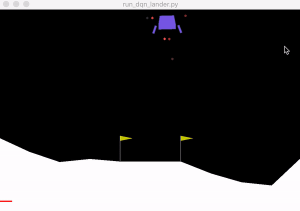 | 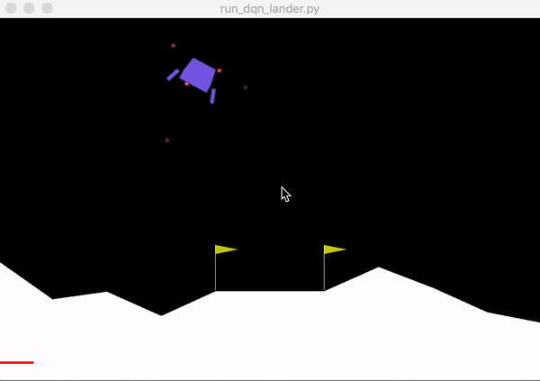 |

|  | Pong Atari (green pedal is controlled by our learning agent) 	
|--|--|
| After 0 timesteps | 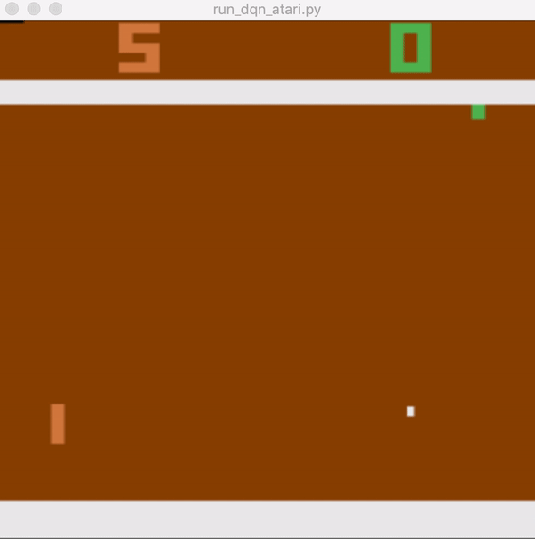 |
| After 500K timesteps | 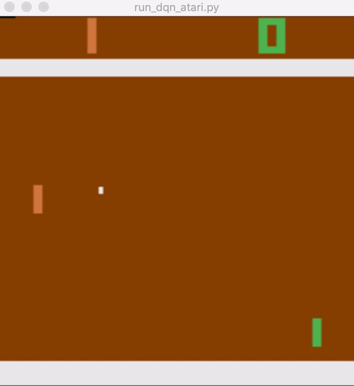 |
| After 1M timesteps | 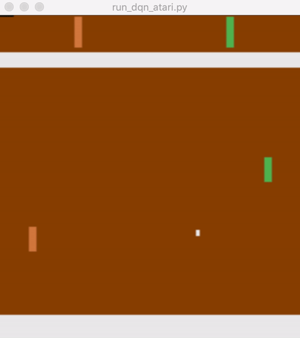 |
| After 1.5M timesteps | 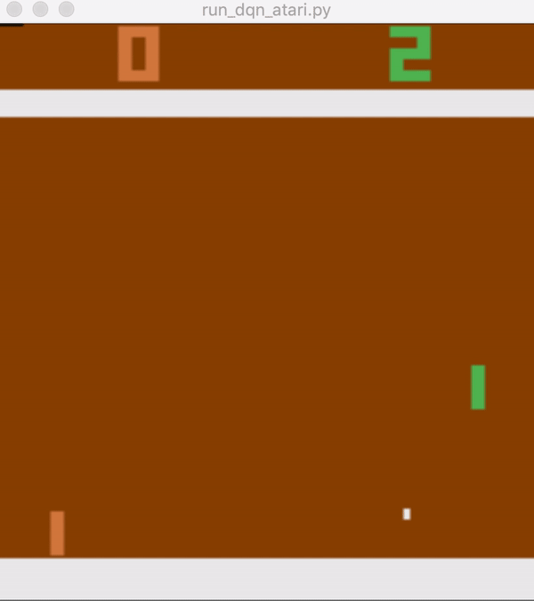 |
| After 2M timesteps | 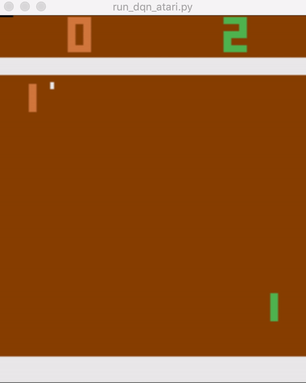 |

## Answers
### Part 1 (Deep Q-learning)

1. **Question 1: Basic Q-learning performance.** *Include a learning curve plot showing the performance of your implementation on the game Pong.*

	For this Question, I used `run_dqn_atari.py` for the experiment.

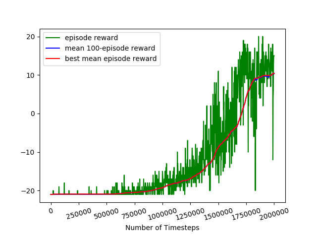

2. **Question 2: Double Q-learning.** *Use the double estimator to improve the accuracy of your learned Q values. This amounts to using the online Q network (instead of the target Q network) to select the best action when computing target values. Compare the performance of double DQN to vanilla DQN.*


	Due to severe computational constraints, it was hard for me to run image-based Atari fast enough to complete this question. So, I used `run_dqn_lander.py` for this question.

	As we can see from the figure below, **Double DQN** improves the performance compared to the **vanilla DQN**. However, as we can see after around 20K timesteps, the mean reward for both **Double DQN** and  **vanilla DQN** drops suddenly. This phenomenon is called ***catastrophic forgetting*** (see [here](https://en.wikipedia.org/wiki/Catastrophic_interference) for a detailed description of this phenomenon and see [this paper](https://arxiv.org/abs/1612.00796) for possible ways to overcome this issue). In the next question, I show that how we can possibly address this issue.
	
	> For the experiments of this question, I used the default values for the hyperparameters: replay buffer size =50000, learning rate = 0.001, target update frequency = 3000.  

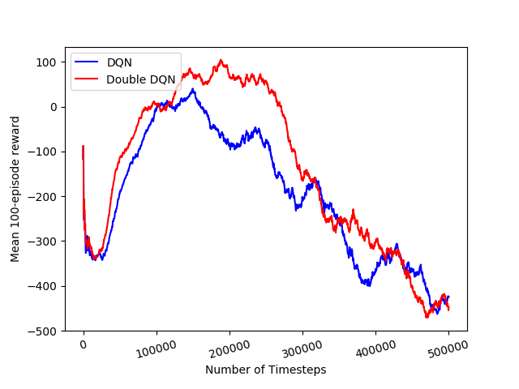


3. **Question 3: Experimenting with hyperparameters.** *Now let's analyze the sensitivity of Q-learning to hyperparameters. Choose one hyperparameter of your choice and run other settings of this hyperparameter, in addition to the one used in Question 1, and plot all the values on the same graph.*

	Due to severe computational constraints, it was hard for me to run image-based Atari fast enough to complete this question. So, I used `run_dqn_lander.py` for this question.
	
	The first experiment I did for this question was to change the *replay buffer size* from 50000 to 500000. As we can see from the figure below, while increasing the *replay buffer size* can lead to a slower training, it can alleviate the *Catastrophic forgetting* issue.
	
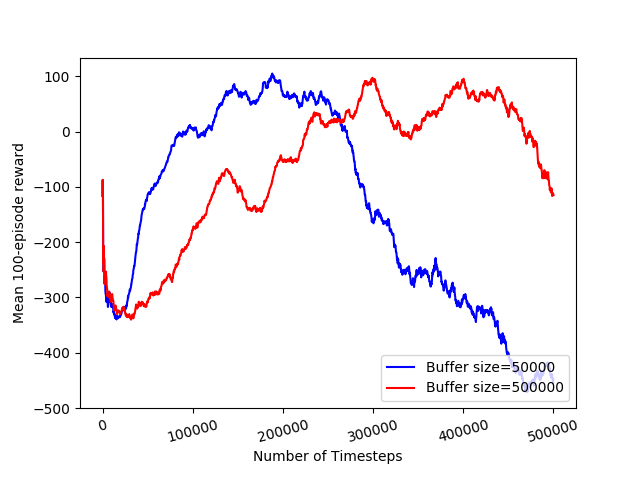

The next experiment I did was to fix the *replay buffer size* to 500000 and change the *learning rate*. As we can see from the figure below, the best performance is observed for the *learning rate* of 0.001.

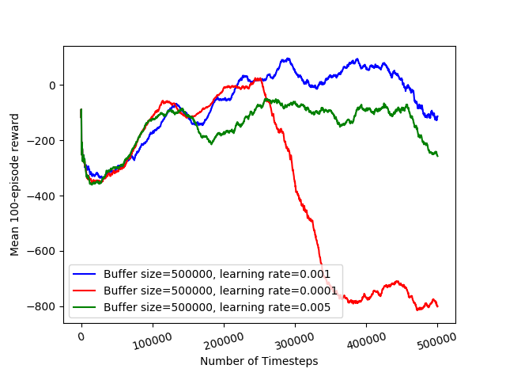

The next experiment I did was to fix the *replay buffer size* to 500000 and change the *target update frequency*. As we can see from the figure below, the best performance is observed for the *target update frequency* of 5000.

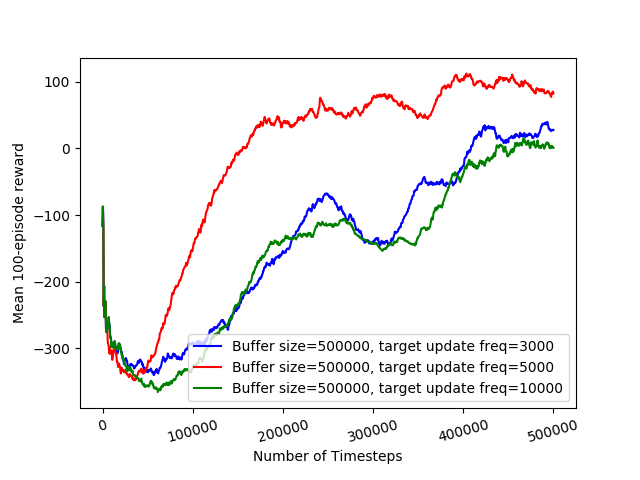
	
	
### Part 2 (Actor-Critic)

1. **Question 1: Sanity check with Cartpole.** *Now that you have implemented actor-critic, check that your solution works by running Cartpole-v0. Compare the results for the following settings and report which worked best*

```Bash
python3.5 ./train_ac_f18.py CartPole-v0 -n 100 -b 1000 -e 3 --exp_name ntu_1_ngsptu_1 -ntu 1 -ngsptu 1
python3.5 ./train_ac_f18.py CartPole-v0 -n 100 -b 1000 -e 3 --exp_name ntu_100_ngsptu_1 -ntu 100 -ngsptu 1
python3.5 ./train_ac_f18.py CartPole-v0 -n 100 -b 1000 -e 3 --exp_name ntu_1_ngsptu_100 -ntu 1 -ngsptu 100
python3.5 ./train_ac_f18.py CartPole-v0 -n 100 -b 1000 -e 3 --exp_name ntu_10_ngsptu_10 -ntu 10 -ngsptu 10

```
In these experiments, `ntu` is the number of target updates for the critic and `ngsptu` is the number of gradient steps per target update. As we can see from the figure below, the case with `-ntu 1 -ngsptu 1` does not work and by increasing both the number of target updates and number of gradient updates, the performance improves. The best performance is observed for `-ntu 10 -ngsptu 10`.


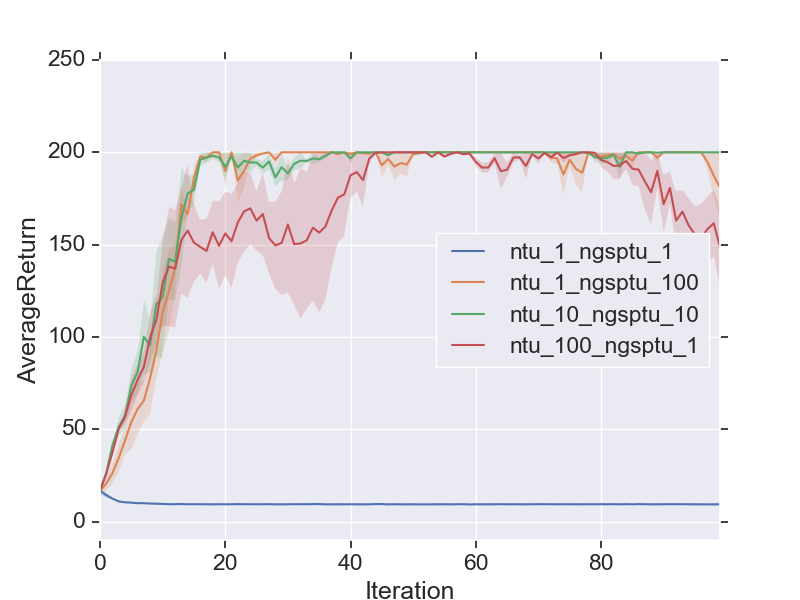

2. **Question 2: Run actor-critic with more difficult tasks.** *Use the best setting from the previous question to run InvertedPendulum and HalfCheetah*

##### `InvertedPendulum`
```Bash
python3.5 train_ac_f18.py InvertedPendulum-v2 -ep 1000 --discount 0.95 -n 100 -e 3 -l 2 -s 64 -b 5000 -lr 0.01 --exp_name ntu_10_ngsptu_10 -ntu 10 -ngsptu 10
```

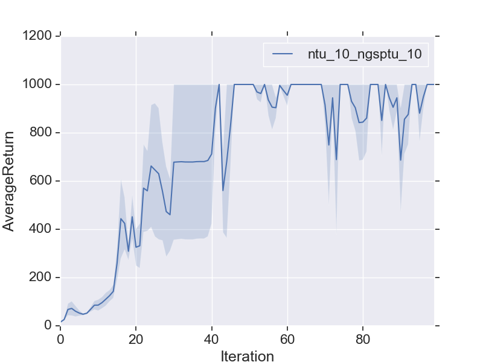

##### `HalfCheetah` 

```Bash
python3.5 train_ac_f18.py HalfCheetah-v2 -ep 150 --discount 0.90 -n 100 -e 3 -l 2 -s 32 -b 30000 -lr 0.02 --exp_name ntu_10_ngsptu_10 -ntu 10 -ngsptu 10

```
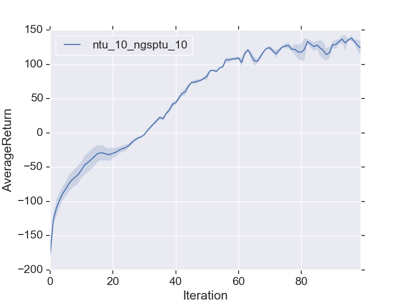

**Extra Question: Compare policy gradient with actor-critic.**

I did this extra set of experiments myself to see the performance comparison between the policy gradient and the actor-critic. I used the same set of hyperparameters for **vanilla polocy gradient**, **policy gradient with baseline**, and **actor-critic**. I have done this comparison for `InvertedPendulum` and `HalfCheetah` environments.

##### `InvertedPendulum`

```Bash
python3.5 train_pg_f18.py InvertedPendulum-v2 -ep 1000 --discount 0.95 -n 100 -e 3 -l 2 -s 64 -b 5000 -lr 0.01 --exp_name policy_gradient
python3.5 train_pg_f18.py InvertedPendulum-v2 -ep 1000 --discount 0.95 -n 100 -e 3 -l 2 -s 64 -b 5000 -lr 0.01 --nn_baseline --exp_name policy_gradient_baseline
python3.5 train_ac_f18.py InvertedPendulum-v2 -ep 1000 --discount 0.95 -n 100 -e 3 -l 2 -s 64 -b 5000 -lr 0.01 --exp_name actor_critic -ntu 10 -ngsptu 10

```

As we can see from the figure below, the performance of all three methods are almost similar, yet we observe less variance for the **actor-critic**.

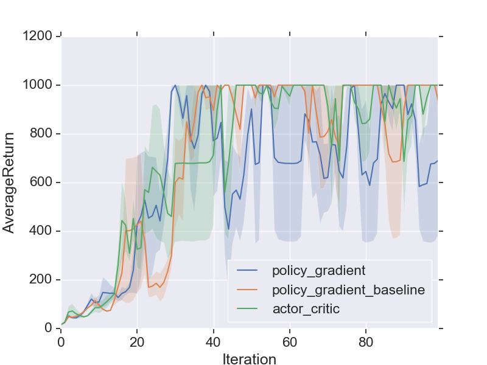


##### `HalfCheetah` 

```Bash
python3.5 train_pg_f18.py HalfCheetah-v2 -ep 150 --discount 0.90 -n 100 -e 3 -l 2 -s 32 -b 30000 -lr 0.02 --exp_name policy_gradient
python3.5 train_pg_f18.py HalfCheetah-v2 -ep 150 --discount 0.90 -n 100 -e 3 -l 2 -s 32 -b 30000 -lr 0.02 --nn_baseline --exp_name policy_gradient_baseline
python3.5 train_ac_f18.py HalfCheetah-v2 -ep 150 --discount 0.90 -n 100 -e 3 -l 2 -s 32 -b 30000 -lr 0.02 --exp_name actor_critic -ntu 10 -ngsptu 10

```

As we can see from the figure below, the performance of the **actor-critic** is remarkably better than **vanilla polocy gradient** and **policy gradient with baseline**.

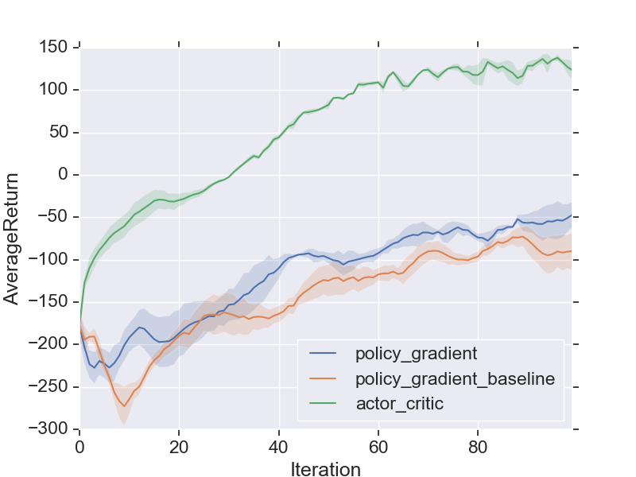


### Todos

 - Write what I learnt about setting this homework (takeaway)
 - Add some videos
 - Write code structure
 - ...
