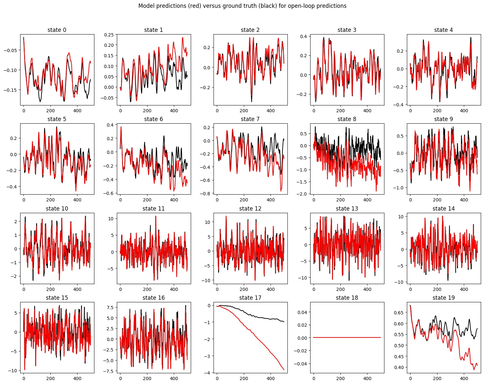

# Homework 4

The goal of this assignment was to get experience with **model-based reinforcement learning (MBRL)**
. Model-based reinforcement learning consists of two main parts: 

1) Learning a dynamics model, 

2) Using a controller to plan and execute actions that minimize a cost function. 

We will be implementing both the learned dynamics model and the controller in this assignment. This assignment is based on this [paper](https://arxiv.org/pdf/1708.02596.pdf).


## Answers
### Problem 1

1. *Provide a plot of the dynamics model predictions when the predictions are mostly accurate.*

```Bash
   python main.py q1 --exp_name exp
```





2. *Which state dimension are the predictions the most inaccurate?*

As we can see from the above figures, **state 17** is the most inaccurate one.


### Problem 2

1. *Provide the ReturnAvg and ReturnStd for the random policy and for your model-based controller trained on the randomly gathered data.*

```Bash
   python main.py q2 --exp_name exp
```


Random policy

|  | values
|--|--|
|ReturnAvg  | -156.222|
|ReturnMax   |-96.4517|
|ReturnMin  |-208.577|
|ReturnStd    |37.7681|

Trained policy

|  | values
|--|--|
|ReturnAvg  | 4.88604|
|ReturnMax   |40.3301|
|ReturnMin  |-44.9942|
|ReturnStd    |23.8242|


### Problem 3

1. *Plot of the returns versus iteration when running model-based reinforcement learning.*

```Bash
   python main.py q3 --exp_name default
```


2. *Plot comparing performance when varying the MPC horizon.*

```Bash
   python main.py q3 --exp_name action128 --num_random_action_selection 128
   python main.py q3 --exp_name action4096 --num_random_action_selection 4096
   python main.py q3 --exp_name action16384 --num_random_action_selection 16384
```


3. *Plot comparing performance when varying the number of randomly sampled action sequences used for planning.*

```Bash
   python main.py q3 --exp_name horizon10 --mpc_horizon 10
   python main.py q3 --exp_name horizon15 --mpc_horizon 15
   python main.py q3 --exp_name horizon20 --mpc_horizon 20
```


4. *Plot comparing performance when varying the number of neural network layers for the learned dynamics model.*

```Bash
   python main.py q3 --exp_name layers1 --nn_layers 1
   python main.py q3 --exp_name layers2 --nn_layers 2
   python main.py q3 --exp_name layers3 --nn_layers 3
```


### Todos

 - Write what I learnt about setting this homework (takeaway)
 - Add some videos
 - Write code structure
 - ...